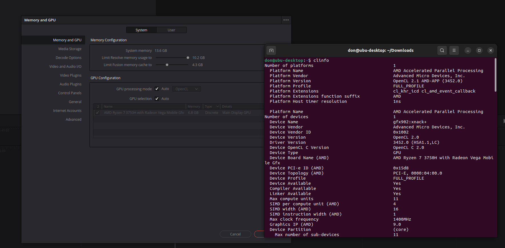

# AMDGPU rocm opencl install for ubuntu 22.04

[](https://discord.com/invite/v8dAnFV) [](https://www.youtube.com/channel/UCrjKdwxaQMSV_NDywgKXVmw) [](https://twitter.com/novaspirittech)

## Installing amdgpu drivers for ubuntu to work with davinci resolve and blender

## About
Installing official [AMDGPU-pro 22.20](https://www.amd.com/en/support/kb/release-notes/rn-amdgpu-unified-linux-22-20) Drivers will fail complaining about dependancy, this repository includes modified rocm-llvm and rocm-gdb to bypass the depenencies needed and will allow the official drivers to properly install.

## Tested

- AMD VEGA 8

## Prequisists

- Ubuntu 22.04.1
- [AMDGPU-pro 22.20](https://www.amd.com/en/support/kb/release-notes/rn-amdgpu-unified-linux-22-20)
- libstdc++-10-dev
- libgcc-10-dev

## Instructions
Download the git repo
```sh
cd amdgpu-rocm-ubu22
cd deb
sudo su
apt install ./rocm-llvm_14.0.0.22204.50200-65_amd64.deb
apt install ./rocm-gdb_11.2.50200-65_amd64.deb
apt install ./amdgpu-install_22.20.50200-1_all.deb
amdgpu-install --usecase=rocm
usermod -a -G render $LOGNAME
usermod -a -G vidoe $LOGNAME
```
reboot

## Results
Screenshot




## References
[https://github.com/RadeonOpenCompute/ROCm/issues/1713](https://github.com/RadeonOpenCompute/ROCm/issues/1713})
